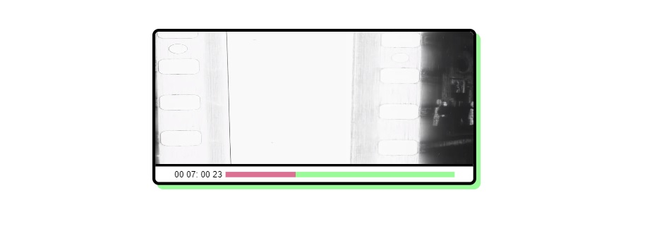

# Video Player 
Super simple video player using XState and React. Xstate is a really clear way to manage 
state in an application that has a very clear user flow - plus the [visualiser is very cool](https://xstate.js.org/viz/?gist=0dae302c2381e375402aa9f82019a857). 

[live demo on codesandbox](https://s9php.sse.codesandbox.io/) 

## Users Can: 
- See a loading state before the being able to press play 
- Play and pause a video once ready 
- navigate through the video using the progress bar 

## To Do: 
- Properly deploy the app - at present it runs in a codesandbox container off the Webpack dev server
- Move styling to Emotion
- after dragging progress bar focus should return to the video
- make styling more suitable for small screens
- add support for touch events on progress bar
- known issue: leaving the progress bar while dragging can cause the progress bar to jump around

### To get this running:  
- clone the repo
- install dependencies 
- run `npm run start` to open the webpack dev server on 8080
